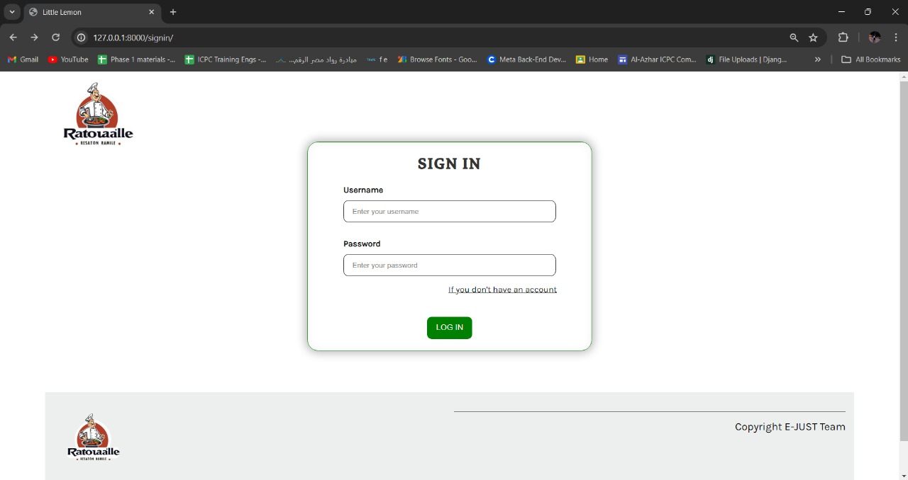
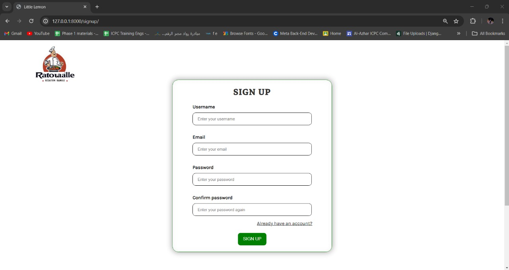
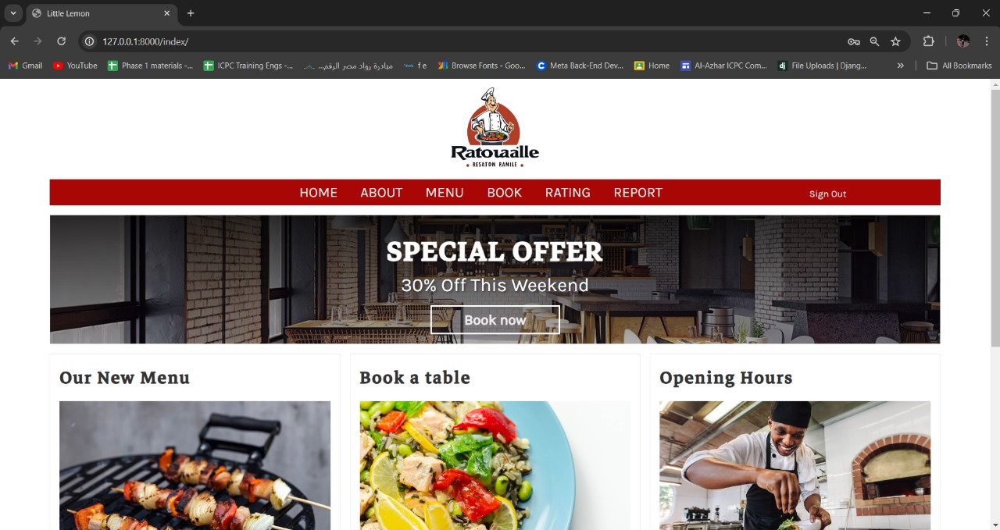
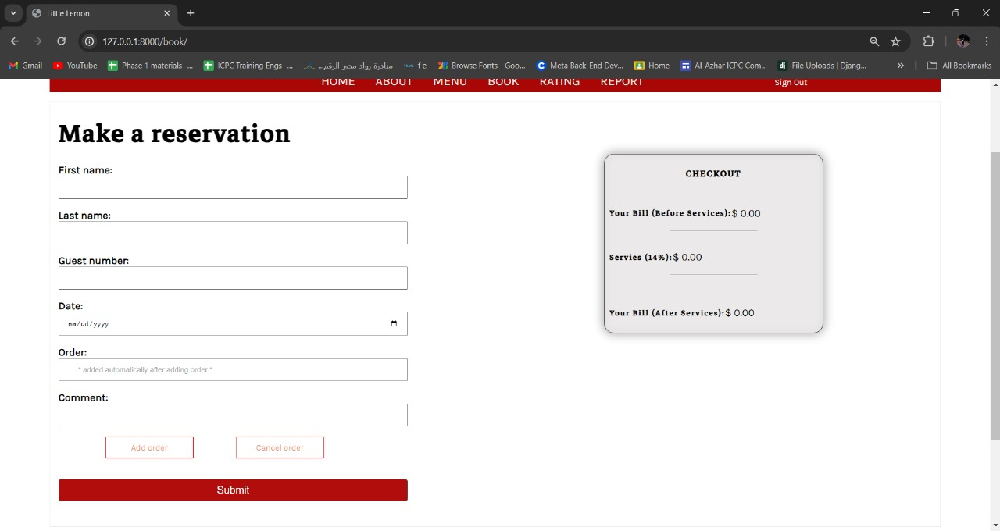
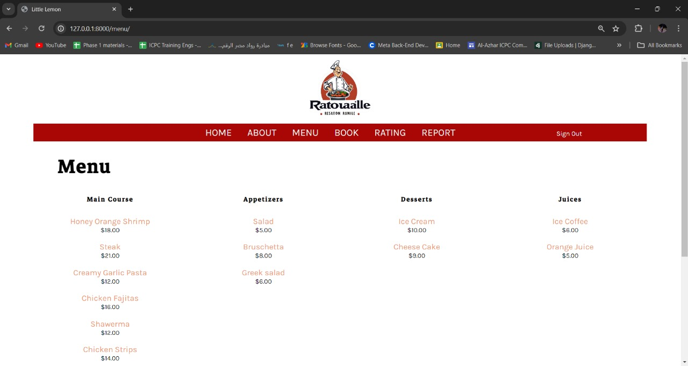
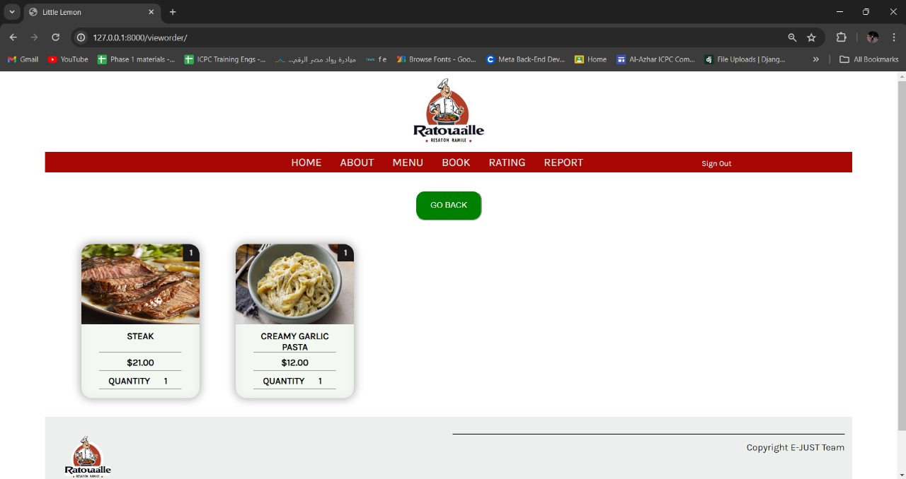
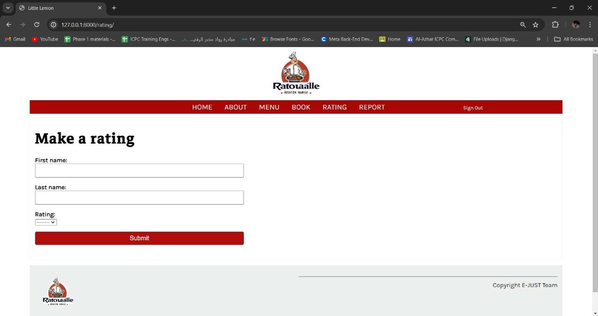

# Restaurant Reservation System

## Project Overview

A web-based **Restaurant Reservation System** designed to streamline table bookings, order management, and menu browsing for both customers and restaurant staff. The system provides a user-friendly interface, efficient backend operations, and secure data management.


---

## Tech Stack

- **Frontend:** HTML, CSS, JavaScript  
- **Backend:** Python, Django  
- **Database:** Microsoft SQL Server  

---

## Features

### For Customers:

- Register and log in to the system.
- Make table reservations by date, time, and number of guests.
- Browse restaurant menus with descriptions and prices.
- Place orders and review them before confirming.
- Cancel reservations anytime.
- Rate the restaurant and submit reports or feedback.

  - **Authentication:** Register and log in.
  - 
  - 
  - - **Homepage/Menu:**
  - 

- **Make Reservations:**
  - 

- **Browse Menu:**
  - 

- **Place Orders:**
  - 

- **View Orders:**
  - 

- **Rate & Report:**
  - 
  - 

### For Staff:
- Register and log in to their dashboards.
- Review and manage customer orders.
- Update table statuses in real-time.
- View their profiles and allowed functionalities.

### For Admin (Manager):
- Full access to all bookings, orders, and tables.
- Manage menu items (add, edit, delete).
- View employee profiles and grant permissions.
- Access customer feedback and reports.
- Generate operational reports.

---

## Installation & Setup

### Backend (Django)

1. Install Python and pip.
2. Install required packages:
   ```
   pip install -r requirements.txt
   ```
3. Configure MS SQL connection in `settings.py`.
4. Run migrations:
   ```
   python manage.py migrate
   ```
5. Start the server:
   ```
   python manage.py runserver
   ```

### Frontend

- Place your HTML, CSS, and JS files inside the `templates` and `static` directories of your Django project.
- Ensure correct linking of templates in your Django views and URL configurations.

---

## Security

- All data exchanges occur over **HTTPS**.
- Passwords are encrypted using Django’s built-in hashing.
- Regular database backups are recommended.

---

## Software Quality Attributes

- Responsive and mobile-friendly design.
- Fast response time (within 2 seconds per action).
- High system availability with scalable infrastructure.

---

## Contact

**Developed by:**  
Ezz Eldin Ayman (120210016)  
Ahmed Mohamed Elkhouly (120210047)  
Ahmed Medhat (120210063)

**Supervised by:**  
Dr. Ahmed Anter  
Eng. Ziad Rohayiem  
Eng. Ahmed Abdelkader
